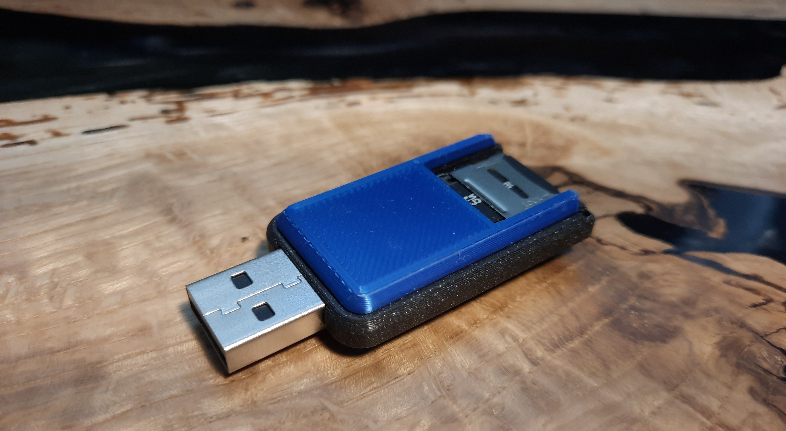
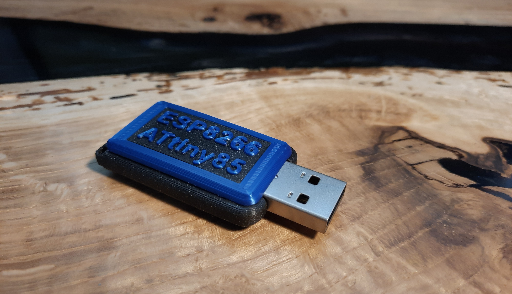
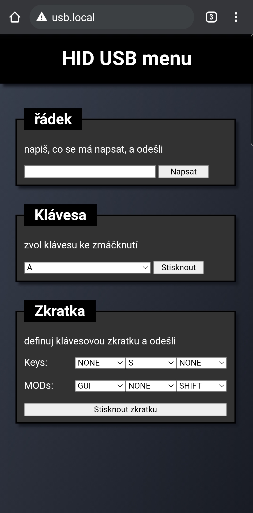

# ESPatUSB
## General desctiption:

  
   

a usb device that gets plugged into a computer and over wifi (ESP-12e) you control HID chip (ATtiny85) that sends keyboard commands(print, key press, shortcut) to the computer. It also has a SD card slot to store your macros (sequences of pre-mentioned commands) controlled by ESP-12e and emmited by ATtiny85 to the computer. The UI is web-based and hosted on the ESP-12e.

## What is attached:

   
  
  
   

- PCB gerber files and schematic design
- .stl and .gcode files for 3D printable casing
- Arduino code for ATtiny85 and ESP-12e
